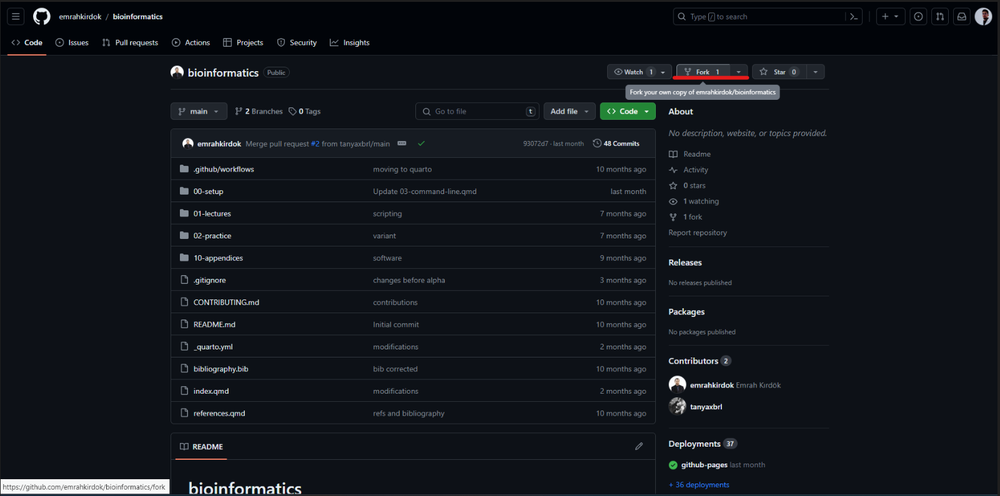
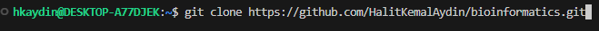
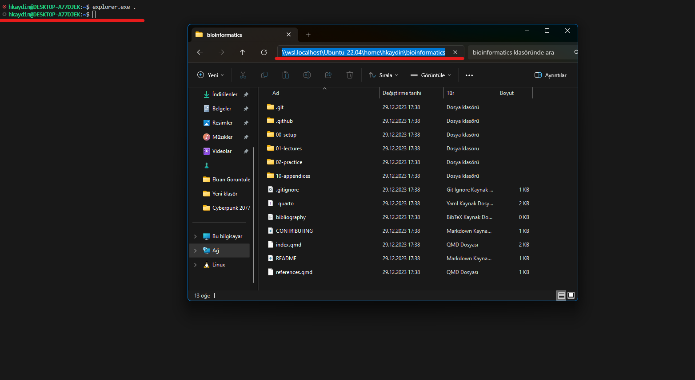
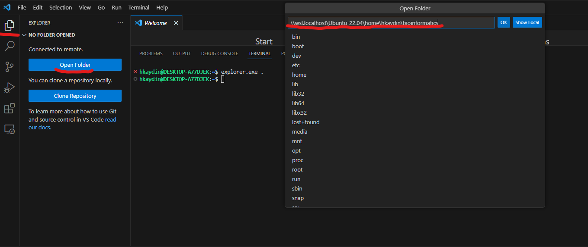
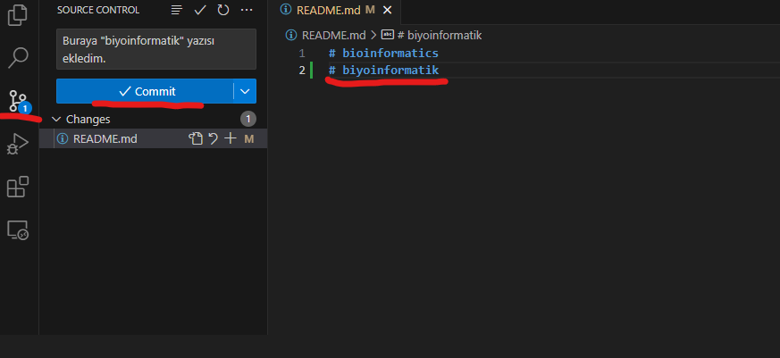
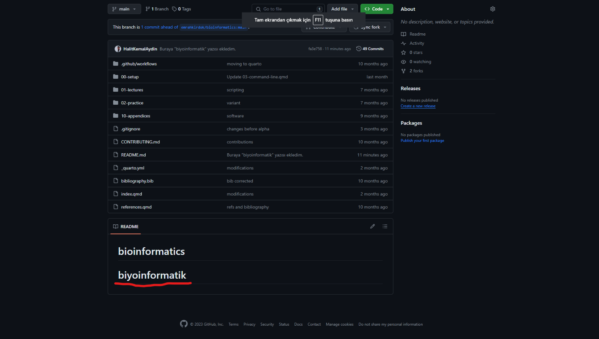

# Github-Guide
# Linux-Github Connection / Linux-Github Bağlantısı

#### Install Visual Studio Code / Vısual Studio Code İndirme:

"https://code.visualstudio.com" You can download VSC from this site. / Adresinden VSC'yi indirebilirsiniz.


#### Download and Connection WSL / WSL İndirme ve Bağlanma

##### (EN) After selecting the “Extensions” section on the left panel, you can download it by typing WSL into the search area at the top left. To connect, press the ⋚ shape indicated by number 1 in the lower left corner and click on “connect to WSL” that appears in the search bar indicated by number 2. 
##### (TR) Sol panelde bulunan "Extensions" bölümünü seçtikten sonra sol üst arama yerine WSL yazarak indirebilirsiniz. Bağlanmak için 1 numara ile belirtilen sol alt köşeden ⋚ şekline basılır ve 2 numara ile belirtilen arama çubuğunda çıkan “connect to WSL” e tıklanır.


Artık VSC üzerinden ubuntu terminali kullanıma hazırdır.

#### Download Git For Configure Github and VSC / Github ve VSC Konfigüre Etmek İçin Git İndirme:

##### (EN) The codes that need to be written to the terminal.
##### (TR) Terminale yazılması gereken kodlar.

##### (EN) Install git to Ubuntu; 
##### (TR) Git i ubuntuya kurmak için;

```
sudo apt install git
```

##### (EN) Control git version;
##### (TR) Git'in versiyon kontrolü için;

```
git --version
```

##### (EN) Connect your github account;
##### (TR) Github hesabınızı bağlamak için;

```
git config --global user.name "kullanıcıadi"

git config --global user.email "kullanıcıadi@gmail.com"
```


#### Lets Test Configure / Konfigüre Olup Olmadığını Test Edelim:

##### (EN) First, we log into our Github account and select a “Repository” to transfer to the terminal. I am choosing Emrah Kırdök’s “Bioinformatics” Repo.
##### (TR) Öncelikle Github hesabımıza giriyoruz, terminale aktarmak için bir “Repository” seçiyoruz. Ben Emrah Kırdök’ün “Biyoinformatik” Reposunu seçiyorum.

##### (EN) Forking the repo will work on to our own account.
##### (TR) Çalışacağımız repoyu kendi hesabımıza forkluyoruz.




##### (EN) After forking click "Code" and copy url to clone terminale.
##### (TR) Forkladıktan sonra terminale klonlamak için "code" a basıp linki koyalıyoruz.


##### (EN) Clone repo to terminale use this code;
##### (TR) Repoyu terminale klonlamak için şu kodu kullanıyoruz;

```
git clone url
```



##### (EN) After clone repo open where it is;
##### (TR) Klonladıktan sonra reponun konumunu açmak için;

```
explorer.exe .
```

##### (EN) Then open folder and copy location which want to reach in VSC 
##### (TR) Sonra ulaşmak istediğimiz dosyayı açık konumunu kopyalıyoruz.



##### (EN) Click on ‘Open Folder’ from the ‘Explorer’ section on the left panel, and paste the location copied into the search bar that opens.
##### (TR) Sol panelde bulunan "Explorer" kısmından "Open Folder" a tıklıyoruz ve açılan arama çubuğuna kopyaladığımız konumu yapıştırıyoruz.



##### (EN) Select a line of directory and make a change. After the change is done, save it by doing “Ctrl + s”. Press the “Source Control” marked on the left panel. In the window that opens, Explain the change made in the text box and press “Commit”.
##### (TR) Bir satır dizini seçiyoruz ve değişiklik yapıyoruz. Değişiklik bittikten sonra “Ctrl + s” yaparak kaydediyoruz. Sol panelde işaretli “Source Control” e basıyoruz. Açılan pencerede metin kutusuna yaptığımız değişikliği açıklıyoruz ve “Commit” e basıyoruz.



##### (EN) The changes make accumulate one by one, and when press ‘Sync Changes’, they are sent to our Github account.
##### (TR) Yaptığımız değişiklikler tek tek birikir ve "Sync Changes" a bastığımızda Github hesabımıza yollar.


##### (EN) The change made appears in the repo we forked on our Github account, which shows that the configuration process was successful.
##### (TR) Yaptığımız değişiklik github hesabımızda forkladığımız repoda gözüküyor bu da konfigüre işleminin başarılı olduğunu gösterir. 


